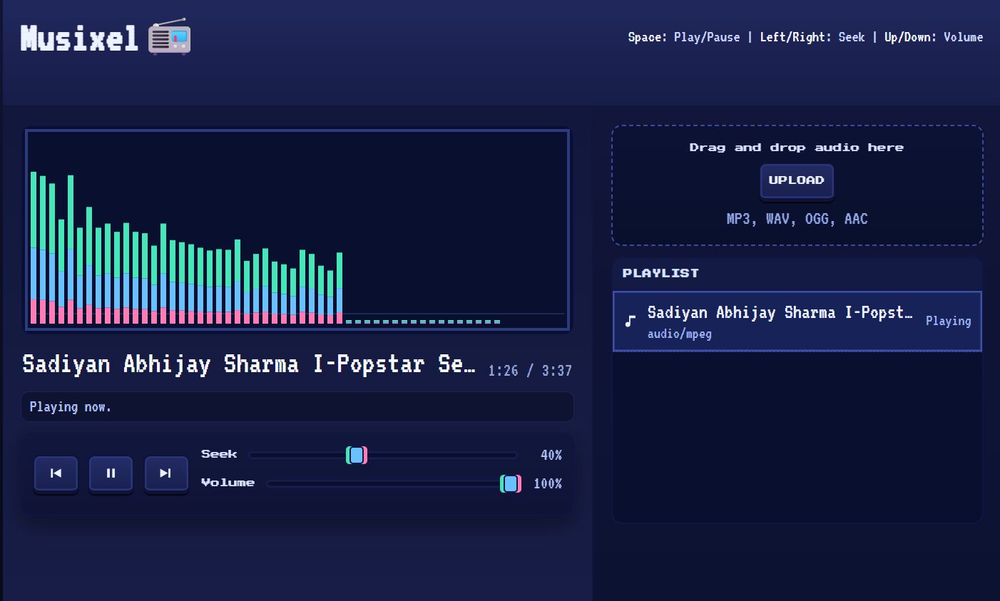

# 🎧 Musixel — Retro Browser Music Player

> A pixel-powered browser music player built with pure frontend magic.
> No frameworks. No dependencies. Just music, neon glow, and late-night coding energy.

---

## 🌌 Overview

**Musixel** is a retro-inspired browser music player that combines nostalgic pixel-art visuals with modern browser audio capabilities.
Built entirely using **Vanilla HTML, CSS, and JavaScript**, it delivers smooth local audio playback, real-time visualizations, drag-and-drop playlist management, and responsive controls — all wrapped in a cyberpunk arcade aesthetic.

Designed to feel like a futuristic cassette deck from an alternate 1980s internet.

---

## ✨ Features

### 🎵 Audio Playback

* Local audio file support
* Play / Pause / Next / Previous controls
* Seek bar with live progress updates
* Persistent volume control using LocalStorage
* Keyboard-first interaction support

### 📂 Playlist Management

* Drag & drop music uploads
* Dynamic playlist generation
* Click-to-play track selection
* Active track highlighting
* Automatic cleanup of unused object URLs

### 📊 Real-Time Visualizer

* Built using the **Web Audio API**
* Frequency analysis using `AnalyserNode`
* Smooth animated canvas rendering
* Neon-styled responsive frequency bars
* Optimized with `requestAnimationFrame()`

### 🎨 Retro Pixel UI

* Pixel-art inspired interface
* CRT/cyberpunk aesthetic
* Neon glow effects
* Responsive layouts for all devices
* Game-console style controls

### ⚡ Performance Focused

* Zero external libraries
* Minimal DOM manipulation
* Lightweight architecture
* Efficient rendering pipeline
* Fast startup and smooth playback

---

# 📸 Preview



---

# 🛠️ Tech Stack

| Technology             | Purpose                        |
| ---------------------- | ------------------------------ |
| **HTML5**              | Structure & audio element      |
| **CSS3**               | Retro styling & responsive UI  |
| **Vanilla JavaScript** | Application logic              |
| **Web Audio API**      | Audio analysis & visualization |
| **Canvas API**         | Real-time visualizer rendering |
| **LocalStorage API**   | Persistent settings            |

---

# 📁 Project Structure

```bash
Musixel/
│
├── musixel.html      # Main application layout
├── styles.css        # Pixel-art retro styling
├── script.js         # Audio engine & player logic
└── README.md
```

---

# 🚀 Getting Started

## 1️⃣ Clone the Repository

```bash
git clone https://github.com/your-username/musixel.git
```

## 2️⃣ Navigate Into the Project

```bash
cd musixel
```

## 3️⃣ Run the App

Simply open:

```bash
musixel.html
```

in your browser.

### Recommended

Use **VS Code Live Server** for a smoother development experience.

---

# 🎧 How Musixel Works

Musixel combines the native HTML `<audio>` element with the **Web Audio API** to create a lightweight but immersive music experience.

### Workflow

1. User uploads audio files
2. Files are validated
3. Temporary object URLs are generated
4. Tracks are dynamically added to the playlist
5. Audio streams into an `AnalyserNode`
6. Frequency data is visualized in real time on a `<canvas>`

The visualizer updates continuously using:

```js
requestAnimationFrame()
```

for smooth and efficient rendering.

---

# ⌨️ Keyboard Shortcuts

| Key     | Action          |
| ------- | --------------- |
| `Space` | Play / Pause    |
| `←`     | Rewind 5s       |
| `→`     | Forward 5s      |
| `↑`     | Increase Volume |
| `↓`     | Decrease Volume |
| `Esc`   | Stop Playback   |

Musixel supports global keyboard controls to provide a desktop music-player feel directly in the browser.

---

# 📦 Core Components

## 🎚️ Audio Engine

* `AudioContext`
* `MediaElementSource`
* `AnalyserNode`
* Playback state management

## 📜 Playlist System

* Dynamic rendering
* Active song tracking
* Click-to-play support
* File metadata handling

## 📊 Visualizer

* Canvas-powered rendering
* Frequency bar animations
* Responsive scaling
* Neon layered glow effects

## 📂 Upload System

* Drag & drop support
* Multi-file uploads
* Audio format filtering
* Memory-safe object URL cleanup

---

# 🧪 Challenges Solved

* Efficient real-time audio visualization
* Smooth synchronization between UI and playback
* Clean drag-and-drop handling
* Responsive retro UI design
* Preventing memory leaks from object URLs
* Maintaining performance without frameworks

---

# 📱 Responsive Design

Musixel is fully responsive and optimized for:

* 🖥️ Desktop
* 📱 Mobile
* 📟 Tablets

Using:

* CSS Grid
* Flexible sizing
* Adaptive layouts
* Responsive breakpoints

---

# 🎨 Design Philosophy

Musixel blends together:

* Retro arcade aesthetics
* CRT-inspired interfaces
* Pixel typography
* Neon cyberpunk palettes
* Soft glow effects
* Vintage console-inspired controls

The goal was to create a music player that feels nostalgic while still modern and smooth to use.

---

# 📄 License

Licensed under the **MIT License**.
Feel free to modify, remix, and build on top of it.

---

# ⭐ Support

If you enjoyed this project:

* ⭐ Star the repository
* 🍴 Fork it
* 🛠️ Improve it
* 🧪 Experiment with it
* 🚀 Build your own version

---

<div align="center">

## 🎵 Built with pixels, caffeine, and dangerously late-night debugging sessions.

</div>
